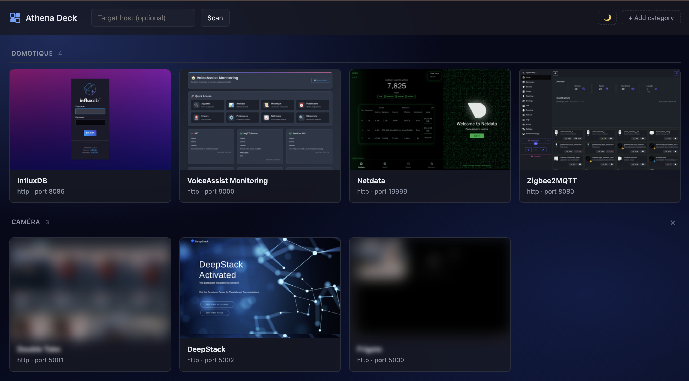

# Athena Deck

A tiny self-hosted dashboard that auto-discovers the web interfaces running on
your home server and renders them as a wall of cards with live screenshot
thumbnails. Point it at a host, click **Fast scan**, and a minute later you
have clickable previews of Home Assistant, Grafana, Portainer, Plex, Sonarr,
n8n, whatever else is listening.



> A live dashboard with two user-defined categories. The Frigate tile in
> *CAMERA* is rendered with the per-tile **Blur thumbnail** option so the
> camera feed doesn't leak in a screenshot — open the 🏷 menu on any card
> to toggle it.
>
> If you want a service-free preview to embed somewhere else,
> `docs/mockup.html` is a self-contained static page that re-uses the
> dashboard CSS with sample tiles, renderable to PNG via headless Chrome:
>
> ```bash
> "/Applications/Google Chrome.app/Contents/MacOS/Google Chrome" \
>   --headless=new --disable-gpu --hide-scrollbars \
>   --force-device-scale-factor=2 --window-size=1280,1100 \
>   --screenshot="$(pwd)/docs/screenshot.png" \
>   "file://$(pwd)/docs/mockup.html"
> ```

* **Backend** — FastAPI + Playwright (headless Chromium) for screenshots.
* **Frontend** — a single static `index.html`, no build step, no framework.
* **Packaging** — one container; runs via `docker compose up`.

## What it does

1. TCP-scans the configured host (default `host.docker.internal`) for open
   ports — either a curated list of common web ports (fast) or all of 1–65535
   (full).
2. For each open port, sends an HTTP GET (then HTTPS), grabs the `<title>` if
   any, and treats it as a web service.
3. Launches Chromium and snapshots each URL at 1280×800, downscaling to a
   ~400px PNG thumbnail.
4. Writes `services.json` + per-port PNGs to a cache directory, and serves them
   to a small dark-themed dashboard.

## Configuration

All settings are environment variables.

| Variable                  | Default                  | Meaning |
|---------------------------|--------------------------|---------|
| `APP_PORT`                | `8888`                   | Port the dashboard listens on. |
| `SCAN_HOST`               | `host.docker.internal`   | Host that the scanner targets. |
| `CACHE_DIR`               | `/data`                  | Where `services.json` and `thumbs/` live. |
| `SCAN_CONCURRENCY`        | `500`                    | Max concurrent TCP connect attempts. |
| `SCAN_CONNECT_TIMEOUT`    | `0.3`                    | Connect timeout per port (seconds). |
| `SCREENSHOT_TIMEOUT_MS`   | `12000`                  | Playwright page-navigation timeout (ms). |
| `SCREENSHOT_SETTLE_MS`    | `2500`                   | Extra wait after page load before snapping (ms). |
| `SCREENSHOT_CONCURRENCY`  | `3`                      | Parallel headless contexts during capture. |
| `SCREENSHOT_COLOR_SCHEME` | `dark`                   | `dark` / `light` / `no-preference` — what the browser reports for `prefers-color-scheme`. |
| `SCREENSHOT_FORCE_DARK`   | `true`                   | When `true`, enables Chromium's experimental auto-dark for sites that ignore the media query. Set to `false` if auto-inversion looks worse than the native light theme on your apps. |

You can also override `SCAN_HOST` per-scan from the UI: type a host into the
text field next to the scan buttons (it's persisted to localStorage).

## Running it with Docker

Two modes. **Linux servers should prefer host networking.**

### A. Bridge networking + `host.docker.internal` (macOS / Windows Docker Desktop)

```bash
docker compose up -d
# open http://localhost:8888
```

The default `docker-compose.yml` exposes the dashboard on `localhost:8888` and
targets the host via `host.docker.internal`. Works out of the box on Docker
Desktop. On Linux that hostname doesn't resolve, so either set `SCAN_HOST` to
your docker bridge IP (`172.17.0.1` is the usual default) or switch to mode B.

### B. Host networking (recommended on Linux)

Edit `docker-compose.yml`, uncomment `network_mode: host`, and set
`SCAN_HOST=127.0.0.1`. Then:

```bash
docker compose up -d
# open http://<your-host>:8888
```

With `network_mode: host` the `ports:` mapping is ignored — the dashboard is
reachable directly on the host's `8888`. The container can also see every
`127.0.0.1` service on the host without NAT, which is exactly what we want.

### Cache volume

Thumbnails and `services.json` live in the `athena_data` named volume, so
your card wall survives container restarts. Wipe it with
`docker volume rm athena-deck_athena_data` if you want to start fresh.

## Running it without Docker (dev path)

You need Python 3.10+ and Chromium installed via Playwright.

```bash
cd backend
python -m venv .venv && source .venv/bin/activate
pip install -r requirements.txt
playwright install chromium

# from the repo root:
CACHE_DIR=./.cache SCAN_HOST=127.0.0.1 \
  uvicorn backend.app:app --host 0.0.0.0 --port 8888 --reload
```

Then open <http://localhost:8888>.

## API

| Method | Path                       | Notes |
|--------|----------------------------|-------|
| GET    | `/`                        | The static `index.html`. |
| GET    | `/api/services`            | Cached `services.json`. |
| POST   | `/api/scan/fast?host=X`    | Start a fast scan in the background. `host` is optional. |
| POST   | `/api/scan/full?host=X`    | Same, full 1–65535 range. |
| GET    | `/api/scan/status`         | Live scan progress (`checked` / `total`, phase, errors). |
| GET    | `/api/thumb/{port}`        | PNG thumbnail for a port (1×1 transparent placeholder if missing). |

`POST /api/scan/*` returns `409` if a scan is already running.

## Security note (please read)

* **Do not expose Athena Deck to the public internet.** It reveals which
  internal services you run, and the scan endpoints will happily port-scan
  whatever host you point them at. Keep it on your LAN, behind a VPN, or
  behind your reverse proxy's auth.
* There is **no authentication built in** — that's deliberate (it's a LAN
  toy), but it's also why exposing it publicly would be a bad idea.
* The HTTP probe and screenshotter both ignore TLS certificate errors so
  they can talk to your self-signed services. That's fine on a LAN but means
  the dashboard isn't a substitute for actually verifying certificates.
* Full scans (1–65535) hit every TCP port on the target. On your own host
  that's harmless; on someone else's host it may look like a port scan
  (because it is one). Only scan things you own.

## License

MIT — see [LICENSE](LICENSE).
