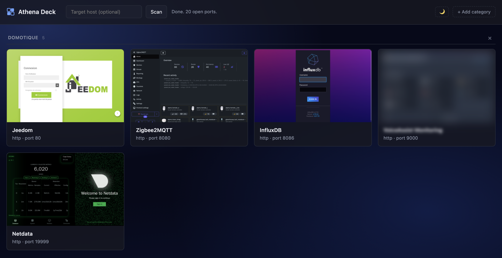
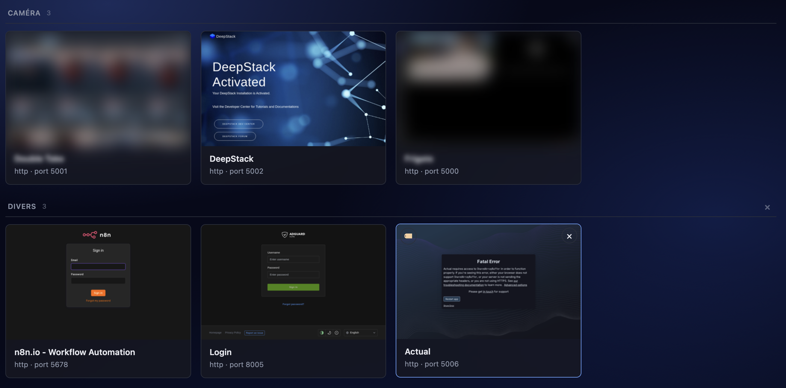

# Athena Deck

A tiny self-hosted dashboard that auto-discovers the web interfaces running on
your home server and renders them as a wall of cards with live screenshot
thumbnails. Point it at a host, click **Scan**, and a minute later you have
clickable previews of Home Assistant, Grafana, Portainer, Plex, Sonarr, n8n,
Jeedom, whatever else is listening.



A live dashboard view with one tile blurred via the per-tile **Blur thumbnail**
toggle so personal previews don't leak in screenshots — open the 🏷 menu on any
card to flip it.



> Need a service-free preview to embed elsewhere? `docs/mockup.html` is a
> self-contained static page that re-uses the dashboard CSS with sample
> tiles, renderable to PNG via headless Chrome:
>
> ```bash
> "/Applications/Google Chrome.app/Contents/MacOS/Google Chrome" \
>   --headless=new --disable-gpu --hide-scrollbars \
>   --force-device-scale-factor=2 --window-size=1280,1100 \
>   --screenshot="$(pwd)/docs/screenshot.png" \
>   "file://$(pwd)/docs/mockup.html"
> ```

* **Backend** — FastAPI + Playwright (headless Chromium) for screenshots.
* **Frontend** — a single static `index.html`, no build step, no framework.
* **Packaging** — one container; runs via `docker compose up`.

## Features

* **Auto-discovery** — TCP-scan the host's 1–65535 range; everything that
  speaks HTTP/HTTPS becomes a clickable card. 404s are kept too but rendered
  as a *no web interface* placeholder rather than wasting a screenshot.
* **Screenshot thumbnails** — Playwright captures each service at 1024×640,
  downscaled to a ~400 px PNG.
* **Cancel in flight** — the *Scan* button turns into *Cancel* while a scan
  is running; click it to abort and try a different host.
* **Categories** — drag the section headers to reorder, drag tiles onto a
  header to assign, or pick from the 🏷 menu on any card.
* **Drag-and-drop reorder** — within a section, drag tiles to reorder; across
  sections, dropping on another tile moves the dragged tile into the target's
  category.
* **Light / dark theme** — toggle from the header; the dashboard's choice
  also becomes the default `prefers-color-scheme` for new screenshots, with
  an option to regenerate existing thumbnails to match.
* **Privacy blur** — flag individual tiles as private; the thumbnail and
  title are CSS-blurred so screenshots don't leak camera feeds or other
  sensitive content. Port stays sharp so the URL is still legible.
* **Hide / restore tiles** — `×` button on any card removes it from view
  (with a confirm). A *Show N hidden tile(s)* link at the bottom of the
  grid restores them all.
* **Server-side preferences** — host override, custom order, categories,
  hidden tiles, privacy flags and theme all sync via
  `/data/preferences.json` so multiple browsers/devices see the same
  dashboard.

## How it works

1. **Port scan** — async TCP scan of the configured host (default
   `host.docker.internal`), chunked to keep memory flat on a 65 535-port
   sweep.
2. **HTTP probe** — for each open port, GET with redirects → if that throws,
   GET without redirects so HTTP 301/302-only services (typical nginx / Caddy
   default) still earn a tile. Status code is recorded.
3. **Screenshot** — Playwright Chromium navigates each URL, waits for
   `networkidle` + a settle delay, captures a PNG, then PIL resizes it down.
   404-responding services skip this step.
4. **Persist** — `services.json` and per-port PNGs live in the cache
   directory; per-user preferences live in `preferences.json` alongside.

## Configuration

All settings are environment variables.

| Variable                  | Default                  | Meaning |
|---------------------------|--------------------------|---------|
| `APP_PORT`                | `8888`                   | Port the dashboard listens on. |
| `SCAN_HOST`               | `host.docker.internal`   | Host that the scanner targets. |
| `CACHE_DIR`               | `/data`                  | Where `services.json`, `preferences.json`, and `thumbs/` live. |
| `SCAN_CONCURRENCY`        | `500`                    | Max concurrent TCP connect attempts. |
| `SCAN_CONNECT_TIMEOUT`    | `0.3`                    | Connect timeout per port (seconds). |
| `SCREENSHOT_TIMEOUT_MS`   | `12000`                  | Playwright page-navigation timeout (ms). |
| `SCREENSHOT_SETTLE_MS`    | `2500`                   | Extra wait after page load before snapping (ms). |
| `SCREENSHOT_CONCURRENCY`  | `2`                      | Parallel headless Chromium contexts during capture. |
| `SCREENSHOT_COLOR_SCHEME` | `dark`                   | `dark` / `light` / `no-preference` — fallback `prefers-color-scheme` the browser reports when no theme is set in the UI. |
| `SCREENSHOT_FORCE_DARK`   | `true`                   | When `true`, enables Chromium's experimental auto-dark for sites that ignore the media query (only applied when the effective scheme is `dark`). Set to `false` if auto-inversion looks worse than the native light theme on your apps. |

You can also override `SCAN_HOST` per-scan from the UI — type a host into
the text field next to the Scan button (it's persisted to
`preferences.json`).

## Running it with Docker

Two modes. **Linux servers should prefer host networking.**

### A. Bridge networking + `host.docker.internal` (macOS / Windows Docker Desktop)

```bash
docker compose up -d
# open http://localhost:8888
```

The default `docker-compose.yml` exposes the dashboard on `localhost:8888`
and targets the host via `host.docker.internal`. Works out of the box on
Docker Desktop. On Linux that hostname is also handled via the
`extra_hosts: host-gateway` line in the compose file, which Docker rewrites
to the bridge gateway IP at container start.

### B. Host networking (recommended on Linux)

Edit `docker-compose.yml`, uncomment `network_mode: host`, and set
`SCAN_HOST=127.0.0.1`. Then:

```bash
docker compose up -d
# open http://<your-host>:8888
```

With `network_mode: host` the `ports:` mapping is ignored — the dashboard
is reachable directly on the host's `8888`. The container can also see
every `127.0.0.1`-bound service on the host without NAT, which is exactly
what we want for services that don't expose themselves on the LAN IP.

### Cache volume

Thumbnails, `services.json`, and `preferences.json` all live in the
`athena_data` named volume, so your card wall and customisations survive
container restarts. Wipe with `docker volume rm athena-deck_athena_data`
if you want to start fresh.

### Updates

`update.sh` (at the repo root) pulls and rebuilds in one shot — handy on
the host machine, or wired to a cron / systemd timer for auto-updates:

```bash
./update.sh
```

It no-ops cleanly if there are no new commits.

## Running it without Docker (dev path)

You need Python 3.10+ and Chromium installed via Playwright.

```bash
cd backend
python -m venv .venv && source .venv/bin/activate
pip install -r requirements.txt
playwright install chromium

# from the repo root:
CACHE_DIR=./.cache SCAN_HOST=127.0.0.1 \
  uvicorn backend.app:app --host 0.0.0.0 --port 8888 --reload
```

Then open <http://localhost:8888>.

## API

| Method | Path                                | Notes |
|--------|-------------------------------------|-------|
| GET    | `/`                                 | The static `index.html`. |
| GET    | `/favicon.svg`                      | App icon. |
| GET    | `/api/services`                     | Cached `services.json`. |
| POST   | `/api/scan/fast?host=X`             | Curated common-ports scan (background task). `host` optional. |
| POST   | `/api/scan/full?host=X`             | Full 1–65535 scan (background task). `host` optional. |
| POST   | `/api/scan/cancel`                  | Signal the in-flight scan to bail out at the next checkpoint. |
| GET    | `/api/scan/status`                  | Live scan progress (`checked` / `total`, phase, `screenshots_done`, errors). |
| POST   | `/api/screenshots/regenerate?theme=X` | Re-capture thumbnails against existing `services.json`. `theme` is `light` / `dark` / `no-preference`; falls back to `preferences.json` then env. |
| GET    | `/api/thumb/{port}`                 | PNG thumbnail for a port. 404 if no capture exists yet. |
| GET    | `/api/prefs`                        | User-level dashboard preferences blob. |
| PUT    | `/api/prefs`                        | Replace the preferences blob (JSON object). |

`POST /api/scan/*` returns `409` if a scan is already running.

## Security note (please read)

* **Do not expose Athena Deck to the public internet.** It reveals which
  internal services you run, and the scan endpoints will happily port-scan
  whatever host you point them at. Keep it on your LAN, behind a VPN, or
  behind your reverse proxy's auth.
* There is **no authentication built in** — that's deliberate (it's a LAN
  toy), but it's also why exposing it publicly would be a bad idea.
* The HTTP probe and screenshotter both ignore TLS certificate errors so
  they can talk to your self-signed services. That's fine on a LAN but
  means the dashboard isn't a substitute for actually verifying
  certificates.
* Full scans (1–65535) hit every TCP port on the target. On your own host
  that's harmless; on someone else's host it may look like a port scan
  (because it is one). Only scan things you own.

## Contributing

Issues and pull requests welcome. There's no formal CI yet; if you submit a
PR, please run a fresh `docker compose up --build` locally and check that:

* A scan completes against `localhost`.
* The dashboard renders without console errors in dark **and** light theme.
* Preferences round-trip via `GET /api/prefs` after a drag-reorder /
  category change.

## License

MIT — see [LICENSE](LICENSE).
